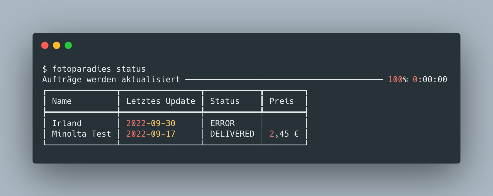
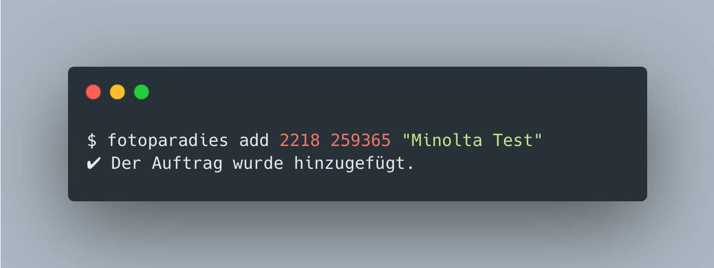
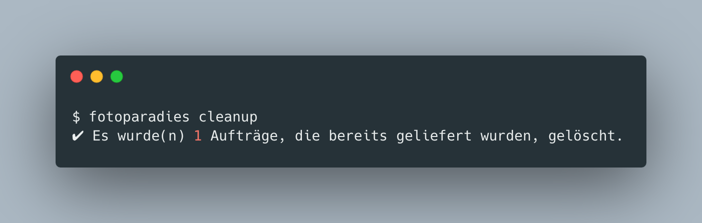
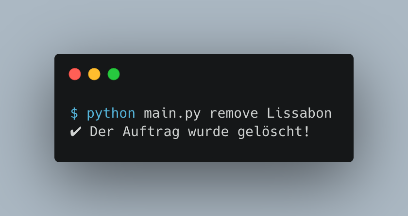

# Fotoparadies Status Checker

📝 Der Fotoparadies Status Checker ermöglicht das Überprüfen des aktuellen Status von abgegebenen Fotoaufträgen (beispielsweise im DM).

## Funktionsweise
1. **Neue Aufträge hinzufügen**
   
    Ein neuer Auftrag wird hinzugefügt, indem das Programm mit `add [Filial-Nummer] [Auftragsnummer] (Name)` aufgerufen wird.
    Der Parameter Name ist optional, er hilft aber die Aufträge voneinander zu unterscheiden.

    

2. **Status der Aufträge anzeigen**

    Den Status der Aufträge, lässt sich mit `status` anzeigen:

    

3. **Gelieferte Aufträge löschen**
   
   Gelieferte Aufträge (Status "Delivered") lassen sich automatisch mit dem `cleanup` Befehl löschen:

   

4. **Auftrag manuell löschen**

    Ein Auftrag lässt sich mit dem `remove [Name]` Befehl manuell löschen. Name ist entweder der in Schritt 1 gesetzter Name oder alternativ die Auftragsnummer.

    

## FAQ

**Q: Wieso ist der Status ERROR?**

A: Der Status ist ERROR, wenn der Auftrag noch nicht im Großlabor angekommen und eingescannt wurde.